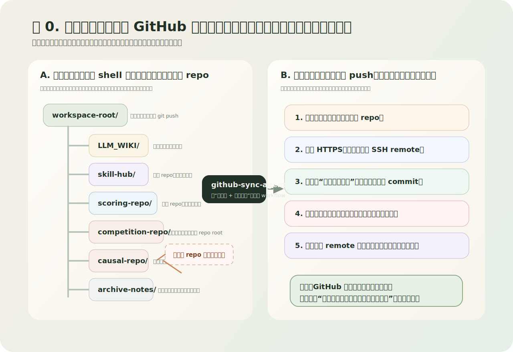

# GitHub Sync Workflow Skill Wiki

## 引子 

起初，GitHub 同步就是 `git add`、`git commit`、`git push` 三下结束。

后来为了配合 CLI 开发方式，少在仓库之间来回切，少反复解释上下文，根目录只负责中转，渐进式披露的`LLM_WIKI`作为多仓库分发路由，而干活的 repo 有的在顶层，有的还包在下一层。

我到底站在哪个 repo，眼前这批改动该不该提，推的时候走 HTTPS 还是 SSH，一个 remote 上去以后另一个是不是还落着，这些事总得重新过一遍脑子。

太麻烦了！


**图 0** 这是红色石头大王

所以我把这条链路收成了一个 workflow skill。先路由，再判断，再提交，最后验证。顺序定下来，很多重复问题就没那么烦。



**图 1** 这个多仓库区就是为了别总切仓库和找上下文

---


## 摘要

本文介绍一个面向 Git / GitHub 同步场景的通用 skill 原型 `github_sync_workflow_kernel`

这个 skill 不替代 Git，但是它把“从配置到发现仓库、从判断提交范围到推送再到验证”收成一条能重复调用的工作流

它解决的问题主要包括

- 在多仓库工作区里定位目标 repo
- 区分 SSH / HTTPS 两条同步路径
- 保留多 remote 并存策略，不强行重写用户已有配置
- 在提交前识别真实改动、换行符噪音、生成产物和 restored 副本
- 在推送后明确验证“哪个 remote 已同步、哪个 remote 还落后”

当前的主入口是

- `github-sync-agent`

它是一个**工作流 skill。**

---

## 1. 背景 为什么需要一个单独的 GitHub Sync Skill

### 1.1 难点从来不在 `git push`

环境要是足够简单，比如：

- 只有一个仓库
- 只有一个 remote
- 没有未提交噪音
- 没有 SSH / HTTPS 分流

那 GitHub 同步几乎不需要额外抽象。

但真实开发里，麻烦一般都堆在这些地方

- 工作区根目录不是真正干活的 repo，只管导航
- repo 可能嵌套在下一层甚至更深目录里
- 同一个仓库同时保留 HTTPS remote 和 SSH remote
- 某个 remote 的远端已经更新，另一个 remote 却还落后
- 工作区里同时存在真实代码改动、文档改动、换行符噪音和生成副本
- 当前任务有时只需要“补推已有提交”，有时又必须先做新的 commit

更烦的是，这些问题往往不在你写代码的时候冒头，偏偏爱在准备交付、准备同步、准备收尾的时候一起炸出来。

所以这里值得单拎出来的，就是

> **GitHub 同步前后的判断流程。**

### 1.2 它还有一个更前置的想法，先路由，再同步

这里有个很前置的判断

> 在多仓库工作区里，任何执行动作之前，都应该先做路径和归属的路由。

也因为这个，`LLM_WIKI` 对我来说从来不是“补充阅读”，而是整个工作区协作方式的一部分。

它不替代 repo-local 文档，主要做三件事

1. 在工作区根目录先告诉我“当前应该去哪一个 repo”
2. 在启动时做渐进式披露，不上来扫完整个工作区
3. 把跨仓库的环境经验和导航规则集中沉淀，不散落进每个业务仓库

GitHub sync 这套东西，就是顺着这个思路往下长出来的

- `LLM_WIKI` 负责“先找到该去哪”
- `github-sync-agent` 负责“到那个 repo 之后，怎样把同步做对”

如果只把它看成一个 Git skill，范围就窄了。

它落下来有三层东西：

- 多仓库路由思路
- 渐进式披露思路
- GitHub 同步工作流

整套东西就是这样长出来的。

### 1.3 它也不是“Git 入门课”

`github_sync_workflow_kernel` 不负责教人什么是 branch、什么是 commit，也不打算冒充“万能自动推送脚本”。

它就是一个给编码代理用的**同步工作流层**，盯住的是这几件事

1. 当前真实目标仓库是谁？
2. 当前应该走 SSH 还是 HTTPS？
3. 现有本地改动是否应该立刻进入提交？
4. 如果 worktree 很脏，哪些文件应该进这次 commit，哪些不该进？
5. 推送完成后，怎样证明同步真的完成了？

所以它更偏向：

- 工作流组织
- 提交范围治理
- 多远程同步验证

它不承担 Git 基础知识教学。

---

## 2. 真实场景背景，但做了脱敏

这套 skill 的直接背景来自一个真实的多仓库工作区。

为了分享方便，这里把业务项目名称做脱敏，只保留结构特征。

这个工作区大致长这样：

```text
workspace-root/
├── LLM_WIKI/
├── skill-hub/
├── scoring-repo/
├── competition-repo/
├── causal-repo/
├── agent-runtime/
├── archive-notes/
└── idea-notes/
```

只看目录名，它像一个“稍微大一点”的工作区。

麻烦的是里面的层次关系：

- `workspace-root/` 本身是导航层，不应该默认拿来 `git push`
- 某些 repo 是顶层目录，例如 `skill-hub/`
- 某些 repo 实际包在下一层容器目录里（你们知道的，总有些时候存在这种麻烦的情况，其实尽量还是不要这样），例如：

```text
causal-repo/project-main/project-main/
competition-repo/main-optimizer/
```

所以只要一开始站错目录，后续所有 Git 判断都会偏掉。

所以后来我把 GitHub sync skill 的第一阶段定义成

- `discover`

先做 `discover`，不急着 `commit` 和 `push`。

> **先找到 repo root。**

---

## 3. 这个 package 最终落成了什么

当前 package 路径是：

```text
alamo_skillhub/packages/github_sync_workflow_kernel/
```

实际目录结构如下：

```text
github_sync_workflow_kernel/
├── README.md
├── PORTABLE_USAGE.md
├── metadata.json
├── scripts/
│   └── sync_to_codex_home.py
├── github-sync-agent/
│   ├── SKILL.md
│   ├── agents/
│   │   └── openai.yaml
│   └── references/
│       ├── checklist.md
│       ├── commit-scope-policy.md
│       ├── generic.prompt_bundle.yaml
│       ├── remote-strategy.md
│       ├── report-template.md
│       └── wsl-github-setup.md
└── wiki/
    └── github-sync-workflow-wiki.md
```

看到这里基本就明白了，这个 package 不只是塞了一个 `SKILL.md`。

它被拆成了几层：

- `README.md`：从仓库视角解释这个 package 是什么、适合什么时候用
- `PORTABLE_USAGE.md`：说明不依赖 Codex 时如何复用
- `metadata.json`：给工具和搜索层提供机器可读入口
- `github-sync-agent/SKILL.md`：定义主入口 skill 的职责、默认流程和输出契约
- `references/`：承载通用方法，而不是把所有规则堆在一个 prompt 里
- `scripts/sync_to_codex_home.py`：用于安装到本机 Codex skill 目录

这其实延续了一个我现在很偏好的原则：

> **主入口负责“怎么调度”，引用资料负责“依据什么做判断”。**

---

## 4. Skill 的核心设计：它是一条同步工作流

### 4.1 主入口：`github-sync-agent`

这个 package 的真正主入口是：

- `github-sync-agent`

它不会简单甩一串 Git 命令给你，而是把整个流程组织成九步：

1. 识别真实目标仓库
2. 检查当前分支、upstream、remotes、worktree
3. 检查 auth 路径：SSH 还是 HTTPS
4. 判断是“只推已有提交”还是“要先做新 commit”
5. 审查剩余 diff，区分真实内容和噪音
6. 只暂存本次真正要提交的范围
7. 创建 commit
8. 推送指定 remote
9. 回头验证最终状态

这条链路的意义是：

- 把“推送”从单点命令变成一条可复用、可解释的过程
- 让代理在执行前先获得足够上下文
- 降低“误推错仓库”“误把噪音一起提交”“误以为所有 remote 都同步了”的概率

### 4.2 为什么要强调 Multi-Repo Rule

在这个 skill 里，我专门把一条规则写得很靠前：

- **不要默认把工作区根目录当成目标 repo**

这是因为多仓库工作区里，最常见的失误就是：

- 当前 shell 在 workspace root
- 但真实要同步的是某个嵌套 repo
- 然后开始在错误位置看 `git status`、看 remote、甚至尝试提交

所以这个 skill 直接把 `repo discovery` 放在第一阶段，不当附加步骤。

### 4.3 为什么要强调 Remote Strategy Rule

这套 skill 还专门把“多 remote 并存”作为显式策略写进参考资料。

原因很简单：真实环境里，很多人并不想把现有 HTTPS remote 全部抹掉。

更稳妥的做法往往是：

- 保留已有 remote，例如 `origin`
- 再新增一个专门的 SSH remote，例如 `github-ssh`

例如：

```text
origin      https://github.com/<user>/<repo>.git
github-ssh  git@github.com:<user>/<repo>.git
```

这样做的好处是：

- 用户原本的 HTTPS 用法不受影响
- 代理需要显式走 SSH 时可以明确指定 `github-ssh`
- 不会把“远程地址改造”强塞成一次必须的破坏性变更

### 4.4 为什么要强调 Commit-Scope Rule

真正容易把仓库搞脏的，通常是 **乱 stage**。

真实仓库里经常混着这些东西：

- 真实代码改动
- 文档更新
- 换行符变化
- restored 副本
- 生成型输出

如果没有明确的 commit-scope 规则，代理很容易把它们“一锅炖”进同一个 commit。

所以这个 skill 明确要求：

- 先分类
- 再决定 stage
- 必要时分多个 commit

这条规则看起来很朴素，但对真实同步场景非常关键。

---

## 5. references 层具体装了什么

这个 package 的核心方法论没有全部写死在 `SKILL.md` 里，而是拆到了 `references/`。

### `checklist.md`

这是整条 GitHub sync workflow 的最小清单，覆盖：

- repo 发现
- Git 状态检查
- auth 路径检查
- commit 范围审查
- push
- 验证

它的作用很朴素，就是把流程拆成可复核的阶段。

### `remote-strategy.md`

这个文件专门解释：

- 为什么 HTTPS 和 SSH 可以并存
- 为什么推荐 `github-ssh` 这种显式命名
- 为什么不能把一个 remote 的状态误当成所有 remote 都同步了

### `commit-scope-policy.md`

这个文件定义提交边界：

- 什么应该默认纳入 commit
- 什么应该默认排除
- 什么时候应该拆成第二个 commit

它做的是把“提交范围治理”从经验变成一条可重复执行的策略。

### `wsl-github-setup.md`

这个文件记录了一个特别实用的环境经验：

在 WSL 里，如果 GitHub `22` 端口不稳定，可以走：

```sshconfig
Host github.com
  HostName ssh.github.com
  User git
  Port 443
  IdentityFile ~/.ssh/id_ed25519
  IdentitiesOnly yes
```

它处理的是一个非常现实的问题：

> SSH 没坏，只是默认端口路径在当前网络里并不好用。

### `generic.prompt_bundle.yaml`

这个文件是为了非 Codex 场景准备的。

它把整条工作流拆成：

- discover
- inspect
- classify
- commit
- push
- verify

换个宿主，就算它不理解 skill token，这条方法也还是能迁过去。

---

## 6. 为什么这个 package 不是“只适合我的机器”

虽然这套 skill 明显来自一个真实的 WSL + 多仓库 + GitHub SSH 场景，但它并没有被做成一个只能在我当前机器里跑通的私有脚本。

这里做了几层抽象：

### 6.1 把本机经验和通用策略分开

例如：

- “多 repo 工作区里先找真实 repo root”是通用策略
- “GitHub SSH 走 `ssh.github.com:443`”是 WSL / 当前网络下的高价值经验

前者属于工作流规则，后者属于环境适配经验。

所以它们分别被放进了不同 reference，而不是混成一团。

### 6.2 把 Codex 用法和非 Codex 用法分开

这个 package 同时提供：

- `scripts/sync_to_codex_home.py`
- `PORTABLE_USAGE.md`

前者解决的是：

- “如何安装到本机 Codex skill 目录，下次直接调用”

后者解决的是：

- “如果不是 Codex，而是别的 host，怎么保留这套流程”

这意味着它不是一个“只有本机才有意义”的东西。

### 6.3 把业务项目名脱敏，但保留真实问题形态

在分享内容里，我刻意不强调真实业务项目名，而强调这些真实问题形态：

- 多仓库工作区
- 嵌套 repo
- 双 remote 并存
- WSL SSH 环境
- 提交范围噪音治理

因为真正有复用价值的，往往是问题形态，而不是某个具体项目名字。

---

## 7. 这个 skill 现在能帮我完成什么

如果下次我再遇到 GitHub 同步任务，我不需要再从零重新解释背景。

我可以直接说：

- `用 github-sync-agent 看看我当前站的是不是真实 repo`
- `用 github-sync-agent 检查这次应该只推已有提交，还是先做新 commit`
- `用 github-sync-agent 梳理当前 worktree 哪些该提交，哪些是噪音`
- `用 github-sync-agent 显式推 github-ssh，并验证另一个 remote 是否落后`

下次入口就会从：

- 重新讲一遍背景
- 重新描述 SSH 配置
- 重新解释 remote 策略
- 重新梳理 commit scope

变成：

- **直接调用一个现成 workflow skill**

这就是它最核心的价值。

---

## 8. 这第一版还没有做什么

虽然这个原型已经可用，但它仍然是第一版。

当前还没有做的部分主要包括：

- 没有做真正的可执行 orchestrator 脚本，只定义了 workflow 与资料层
- 没有做自动 repo discovery 脚本封装到 package 内部
- 没有做更细的 diff 分类器
- 没有做针对 PAT / credential helper 的更完整 HTTPS 指南
- 没有做专门的示例 repo overlays

但这些并不影响它作为第一版原型成立。

因为第一版真正要证明的是：

> **这条 GitHub 同步链路已经被抽象成了一个可安装、可复用、可迁移的 skill package。**

这一点现在已经成立。

---

## 9. 一句话总结

如果要用一句话概括这个 package，我会这样说：

> `github_sync_workflow_kernel` 把“找对仓库、看懂 remotes、梳理提交范围、推送并验证”这整条 GitHub 同步流程收成了一个下次可以直接复用的 skill。

---

## 10. 相关路径

当前 package 的关键路径：

- `packages/github_sync_workflow_kernel/README.md`
- `packages/github_sync_workflow_kernel/PORTABLE_USAGE.md`
- `packages/github_sync_workflow_kernel/metadata.json`
- `packages/github_sync_workflow_kernel/github-sync-agent/SKILL.md`
- `packages/github_sync_workflow_kernel/github-sync-agent/references/`
- `packages/github_sync_workflow_kernel/scripts/sync_to_codex_home.py`

如果在 Codex 中安装后，直接使用：

- `github-sync-agent`
