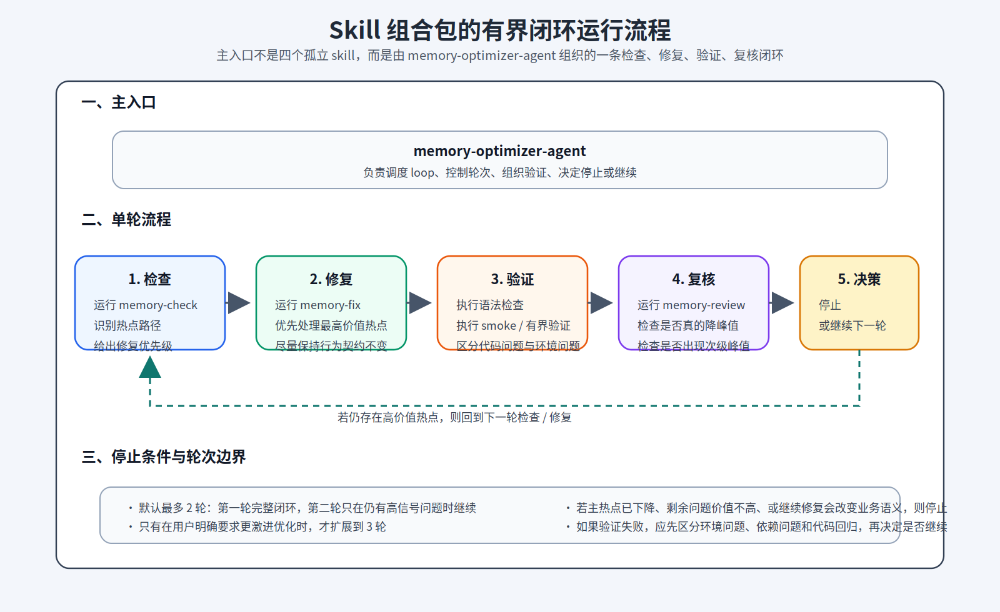
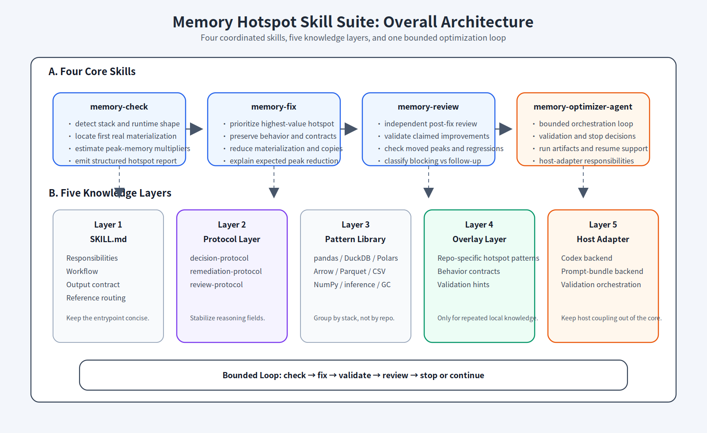
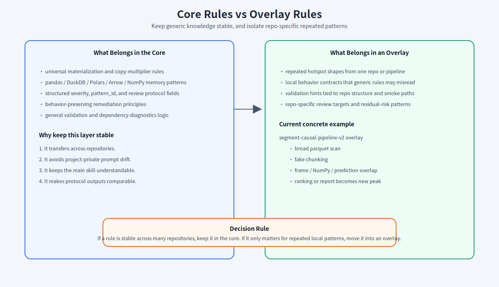
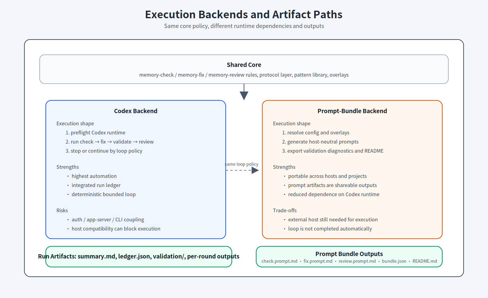
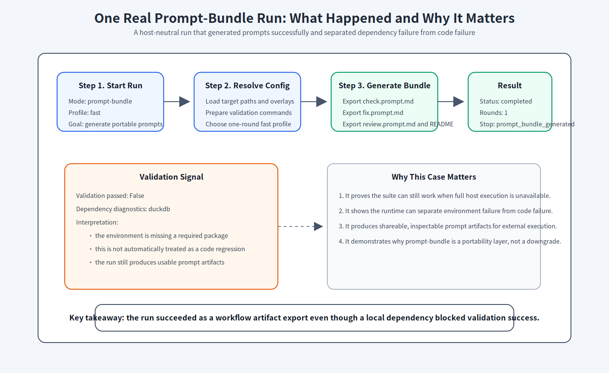
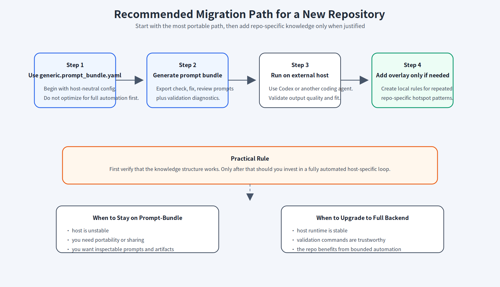

# Memory Hotspot Skill Suite Wiki

## 引子：一个真实的内存热点治理结果

6月的那一天，我正在勤勤恳恳地做投产前测试。

手头并不宽裕，生产环境只给了我 `50 GB` 内存，但排队等着处理的数据却一点也不客气。

我看着配置、看着命令、看着一切都像是已经准备妥当，心里想的只是：这一轮先把它安安稳稳跑完。

“运行”，我按下这个键。前面十几分钟还算平静，日志也没有什么异常。可又过了一阵，一个刺眼的失败提醒还是弹到了屏幕上。我去看资源监测曲线，几乎没有意外：内存一路抬升，最后干脆冲过边界，任务直接被打断。


真正麻烦的地方，其实不是看到“**OOM**”这三个字。

我很快发现，问题通常并没有一个单独的“罪魁祸首”。它往往是几种并不夸张、却会互相叠加的模式一起造成的：先全量读取、再内存切块；宽范围扫描后再做局部过滤；多个大对象同时驻留；修完主流程后峰值又转移到聚合或报表阶段。

也就是说，难点从来不只是“内存高”，而是很难快速判断：热点到底在哪里形成，应该先修哪一段，以及修完之后是否真的下降了。

### 于是，一套闭环skill出现了

这套 skill suite 最早并不是从抽象设计出发，而是从一个高数据量批处理 pipeline 的真实内存问题中逐步沉淀出来的。

在原始实现中，关键路径长期存在明显的 **memory hotspot**：当数据规模上来后，任务容易出现峰值内存快速抬升，热点阶段的内存占用可超过 50 GB，导致运行不稳定，严重时会直接 OOM。问题并不集中在单一语句，而是由全量 materialization、假 chunking、宽范围扫描和多份中间对象同时驻留等模式叠加形成。

围绕这类问题，我没有采用一次性重写 pipeline 的方式，而是将问题拆解为**可审查、可修复、可复核的闭环流程**：先识别热点，再执行保守修复，随后做最小必要验证，最后独立复核剩余风险。以 `partitioned_batch_pipeline` 这一类脱敏示例 pipeline 为代表（位置在examples\memory_hotspot_repair_kernel)，经过数轮有边界的优化后，内存峰值从原先的高风险区间显著压低到可控范围，运行稳定性也从“大数据量下容易失败”改善为“能够稳定完成主要处理流程”。

更关键的是，**这并不是四个彼此独立摆放的 skill**，而是一个以 `memory-optimizer-agent` 为主入口的有界闭环系统。真正的使用方式是：

检查→修复→验证→复核

再根据结果决定停止还是进入下一轮。



**图 0** 用一张图概括了这套 skill 组合包的主流程。真正的主入口是 `memory-optimizer-agent`，而 `memory-check`、`memory-fix`、`validation`、`memory-review` 是被它组织起来的一条有界 loop，而不是四个互不相关的单点能力。

| 指标       |                                              优化前 |                                                  优化后 |
| ---------- | --------------------------------------------------: | ------------------------------------------------------: |
| 峰值内存   |                                              >50 GB |                                          约 20 到 30 GB |
| 运行稳定性 |                       大数据量下容易 OOM 或中途中断 |                                  可稳定完成主要处理流程 |
| 热点形态   | 全量 materialization、假 chunking、多份对象同时驻留 |                  更接近真实分块，减少不必要副本与宽扫描 |
| 处理方式   |                                        人工零散排查 |          结构化闭环：check -> fix -> validate -> review |
| 可迁移性   |                                      依赖单项目经验 | 已沉淀为通用 skill 包与 portable workflow（便携工作流） |

这次内存峰值之所以能明显下降，核心不是依赖某一个“神奇参数”，而是集中处理了几类高影响问题：

- 将伪分块处理推回真实读取边界，避免“先全量读入、再在内存中切块”
- 缩小不必要的宽范围扫描与中间对象驻留时间，减少多份大对象同时存在
- 用结构化闭环替代一次性猜测式修改，让每一轮优化都围绕明确热点、最小修复和独立复核展开

更重要的是，这次工作最终沉淀的不只是一次局部修复，而是一套可以跨项目迁移的 memory hotspot skill 体系。

本文后续内容将说明，这套体系是如何从一次真实问题治理过程，演化成可复用的 `memory-check -> memory-fix -> validation -> memory-review` 闭环。

***此体系目前只做了在资源有限环境中，Python相关技术栈处理大数据量情况优化，主要涉及：***

- **Universal patterns**
- **pandas**
- **DuckDB**
- **Arrow / Parquet**
- **CSV**
- **NumPy**
- **Polars**
- **model inference（模型推理）**
- **GC / cleanup**

试用请访问**github**：[alamo_hub](https://github.com/Alamoooooooo/alamo_hub/tree/main)/packages/memory_hotspot_repair_kernel

链接：[github.com/Alamoooooooo/alamo_hub/tree/b0d932c67c69f01993d7ec2bf61d3f92e6b27d54/packages/memory_hotspot_repair_kernel](https://github.com/Alamoooooooo/alamo_hub/tree/b0d932c67c69f01993d7ec2bf61d3f92e6b27d54/packages/memory_hotspot_repair_kernel)

---

## 摘要

本文介绍一套面向内存热点问题的 skill suite，包括其设计目标、架构分层、执行方式、迁移方法和运行案例。该套件用于识别代码中的高峰值内存风险、提供行为保守的修复建议、在修复后执行独立复核，并支持在不同项目和不同宿主环境之间迁移。

与一般性能优化工具不同，这套 skill suite 的重点不是自动寻找所有性能问题，也不是替代 profiler（性能分析工具），而是围绕“峰值内存风险”建立一套稳定、可复用、可验证的工程工作流。

该套件由四个核心 skill 组成：

- `memory-check`
- `memory-fix`
- `memory-review`
- `memory-optimizer-agent`

四者共同形成“检查、修复、验证、复核”的闭环。为提升通用性，套件同时引入了协议层、模式库、overlay 机制和双后端执行路径。

---

## 1. 问题背景

### 1.1 为什么需要单独关注 memory hotspot

在数据处理、特征工程、批量处理、推荐排序、离线评分等场景中，任务失败常常不是由语法错误或显式逻辑错误引起，而是由峰值内存突然升高引起。此类问题通常具有以下特点：

- 小规模样本可以正常运行，规模增大后才暴露问题
- 风险常常出现在 materialization（结果实体化）、复制放大、阻塞算子或 fallback（回退）路径中
- 问题位置不一定是主要业务逻辑，往往隐藏在读写、转换、聚合或推理边界
- 普通 code review 可以发现一部分风险，但难以系统识别峰值内存问题

典型情况包括：

- **大型 parquet 结果一次性转为 pandas DataFrame**
- **看似在做 chunking，实际仍然是全量读入后再切块**
- **流式执行在关键节点退化为 eager collect**
- **DataFrame、NumPy array、模型输入和预测结果同时驻留内存**
- **前部热点被修复后，峰值转移到排序、聚合或报表阶段**

因此，memory hotspot 更适合被视为一种专门的工程审查对象，而不是零散地并入一般代码检查。

### 1.2 为什么不直接使用 profiler 替代

profiler 更适合回答运行期问题，例如：

- 真实热点是否存在
- 优化前后内存曲线如何变化
- 哪一步在运行中消耗最多内存

此套件更适合回答设计期和审查期问题，例如：

- 哪个位置最可能形成峰值
- 当前代码是否存在假 chunking 或隐藏 materialization
- 修复动作是否改变了业务行为
- 在无法完整运行真实大数据任务时，应如何组织检查和修复流程

因此，两者关系不是替代，而是互补。该套件主要承担工程组织和静态分析支持的角色。

---

## 2. 目标与边界

### 2.1 设计目标

该套件的核心目标如下：

- 结构化识别 memory hotspot，并明确热点位置、风险等级和优先顺序
- 提供行为保守的修复建议或修复动作，避免静默改变业务语义
- 在修复后执行独立复核，识别 moved peak、回归和 correctness 风险
- 支持跨项目迁移，降低在新仓库中重新设计 prompt 的成本
- 降低对单一宿主环境的依赖，使其可以在不同运行方式之间切换

### 2.2 非目标

该套件明确不承担以下职责：

- 不替代 profiler、监控系统或完整性能测试
- 不保证一次性自动修复所有内存问题
- 不以改变业务语义为代价换取内存改善
- 不要求所有项目都建立 overlay
- 不试图成为通用性能优化框架

因此，该套件应被理解为“围绕内存峰值风险的结构化工程工作流”，而不是“自动优化黑盒”。

---

## 3. 总体架构

### 3.1 四个核心 skill

#### `memory-check`

用于识别内存热点，并产出结构化的风险报告。主要关注：

- 第一处真实 materialization 在何处发生
- 最大对象在内存中可能同时存在几份
- 当前代码中有哪些 safeguard
- 哪些结论仅凭静态分析无法完全确认

#### `memory-fix`

用于针对已识别热点执行保守修复。其目标不是自由重构，而是用最小改动降低峰值内存风险，并尽量保持原有业务行为不变。

#### `memory-review`

用于对修复结果执行独立复核。它首先仍是代码审查，其次才是内存专项审查。该步骤用于识别下列问题：

- 改善是否真实成立
- 峰值是否仅被转移
- fallback、resume、overwrite 等行为是否被破坏
- 是否引入新的 correctness 风险

#### `memory-optimizer-agent`

用于组织前述三个 skill 的执行顺序。它承担调度与宿主适配职责，形成一条有限循环：

1. `check`
2. `fix`
3. `validation`
4. `review`
5. `stop or continue`

其中：

- `orchestration` 指对流程的调度与串联
- `host adapter` 指与具体运行环境相关的适配层

### 3.2 整体工作流

从功能角度看，这套系统可以概括为一条内存风险处理流水线：

1. 识别最值得优先处理的热点
2. 对热点执行保守修复
3. 进行小范围验证
4. 对修复结果做独立复核
5. 根据风险剩余情况决定是否进入下一轮

其核心价值不在于单个 prompt 的表达质量，而在于职责拆分和闭环完整性。

### 3.3 五层分层模型

为实现可迁移性，套件采用五层结构：

- `Core skill layer`：核心 skill 的职责定义
- `Protocol layer`：输出字段、判断标准和结构化协议
- `Pattern library layer`：按技术栈组织的通用模式库
- `Overlay layer`：项目专有经验与局部约束
- `Host adapter layer`：与执行环境相关的适配层

可以将其概括为：

- 顶层定义“做什么”
- 中间层定义“依据什么知识去做”
- 底层定义“在什么环境里做”

### 3.4 分层原因

如果不做分层，所有规则通常会堆积在单一 prompt 中，容易产生以下问题：

- 通用规则和项目特例混杂
- 在新项目中难以复用
- 宿主变化时需要整体重写
- 读者难以判断哪些是稳定方法，哪些是局部经验

分层后的职责划分如下：

- 核心 skill 负责流程分工
- 协议层负责输出一致性
- 模式库负责通用知识复用
- overlay 负责项目局部知识
- host adapter 负责宿主执行差异

### 3.5 渐进式披露（Progressive Disclosure）

该套件采用渐进式披露原则。信息不集中堆叠在单一入口文件中，而是按层次组织：

- `SKILL.md`：职责、工作流、输出契约、引用路由
- `references/`：协议、模板、模式库、引用、使用说明
- `overlays/`：repo-specific 规则

这样做的直接收益是：

- 减少主上下文冗余
- 便于跨项目复用
- 便于宿主按需加载
- 便于长期维护



**图 1** 展示了该套件的整体工作流与五层知识分层。上半部分对应四个核心 skill 的闭环关系，下半部分对应知识组织结构。

---

## 4. 工程结构

### 4.1 主目录

当前在 skill hub 中的 package 开发源目录位于：

`packages/memory_hotspot_repair_kernel/`

主要目录包括：

- `memory-check/`
- `memory-fix/`
- `memory-review/`
- `memory-optimizer-agent/`
- `references/`
- `scripts/`

### 4.2 单个 skill 的基本结构

每个核心 skill 基本遵循相同布局：

- `SKILL.md`
- `agents/openai.yaml`
- `references/`

统一结构有助于：

- 迁移
- 同步
- 自动化读取
- 维护一致性

### 4.3 关键文件

最值得阅读的入口文件包括：

- `memory-check/SKILL.md`
- `memory-check/references/decision-protocol.md`
- `memory-check/references/source-citations.md`
- `memory-fix/references/remediation-protocol.md`
- `memory-review/references/review-protocol.md`
- `memory-optimizer-agent/SKILL.md`
- `memory-optimizer-agent/references/host-adapter.md`
- `memory-optimizer-agent/references/generic.run.yaml`
- `memory-optimizer-agent/references/generic.prompt_bundle.yaml`
- `scripts/sync_to_codex_home.py`

与运行证据相关的产物包括：

- `summary.md`
- `prompt_bundle/README.md`
- `validation/validation.json`

这些路径表示运行产物的典型形态，而不是当前分享仓库中默认随包提供的固定目录。
在当前 `alamo_skillhub` 仓库中，`runs/` 不作为分发内容保留；运行案例主要通过文档、图示和可移植配置来说明。

---

## 5. 核心组件设计

### 5.1 `memory-check`

`memory-check` 是整套体系的入口组件。其目标不是立即修复，而是先稳定定义问题。

典型输入包括：

- target paths
- 当前代码树
- 必要时的 overlay

典型输出包括：

- `Executive Summary`（执行摘要）
- `Stack Profile`（技术栈画像）
- `Hot Path`（热点路径）
- `Findings`（问题列表）
- `Existing Safeguards`（现有保护措施）
- `Recommended Fix Order`（建议修复顺序）
- `Validation Gaps`（待验证空白）

其判断过程受 `decision-protocol.md` 约束，常用字段包括：

- `severity`
- `pattern_id`
- `hot_path_stage`
- `why_peak_occurs`
- `confidence`
- `runtime_validation_needed`

### 5.2 `memory-fix`

`memory-fix` 的基本策略是“以最小改动换取最实际的峰值改善”。优先处理的方向包括：

- 消除 full materialization
- 将假 chunking 推回真实读边界
- 减少复制放大
- 避免将热点迁移到下游聚合或报表阶段

其输出不仅是补丁，还应说明：

- 修复了什么模式
- 为什么这样修可以降低峰值
- 哪些行为契约被保留
- 哪些问题仍然未解决

对应协议字段包括：

- `target_pattern_id`
- `mitigation_pattern`
- `contract_preserved`
- `expected_peak_effect`

### 5.3 `memory-review`

`memory-review` 的职责是在修复之后进行独立复核。其重点不只是“内存是否下降”，还包括：

- 是否出现假改善
- 是否发生 moved peak
- fallback 是否失真
- 状态恢复语义是否被破坏
- 是否引入新的 correctness 问题

典型协议字段包括：

- `finding_kind`
- `blocking_level`
- `claimed_improvement_verified`
- `new_peak_risk`

### 5.4 `memory-optimizer-agent`

`memory-optimizer-agent` 是 orchestration（流程编排）层，也是 host adapter（宿主适配）层。其核心职责包括：

- 控制多轮 bounded loop（有界循环）
- 执行 preflight（运行前检查）
- 处理 degraded mode（退化执行模式）
- 编排 validation（验证）
- 注入 overlay（项目局部规则）
- 生成 artifacts（运行产物）
- 支持 resume（继续运行）与 partial rerun（部分重跑）

它的定位不是通用规则中心，而是宿主适配中心：

- 内存规则应保留在 `memory-check / fix / review`
- 宿主耦合逻辑应保留在 agent 层

默认 loop 为：

1. 运行 `memory-check`
2. 选择最高价值修复目标
3. 运行 `memory-fix`
4. 执行 focused validation
5. 运行 `memory-review`
6. 决定是否继续

默认最多执行 2 轮。仅在明确要求更激进优化时提升到 3 轮。

---

## 6. 协议层、模式库与 overlay

### 6.1 协议层

协议层用于将判断和修复结果约束为稳定结构，减少纯 prose 输出带来的不稳定性。其主要价值包括：

- 统一字段表达
- 提高跨轮次可比较性
- 支持后续评估与自动分析

三个主要协议文件分别对应：

- `decision-protocol.md`
- `remediation-protocol.md`
- `review-protocol.md`

### 6.2 模式库

模式库按技术栈分组，而不是按项目分组。覆盖内容通常包括：

- Universal patterns
- pandas
- DuckDB
- Arrow / Parquet
- CSV
- NumPy
- Polars
- model inference（模型推理）
- GC / cleanup

原因很直接：技术栈经验更稳定，也更适合跨项目复用。

### 6.3 Overlay 机制

overlay 指只对某个项目、某条 pipeline 或某类局部实现有意义的补充规则层。
它用于承载项目专有、重复出现且高价值的局部规则。它适合存放：

- repo-specific 热点模式
- 行为契约
- validation hints（验证提示）
- 特殊 review targets

不适合存放：

- 通用 pandas 规则
- 通用 DuckDB 规则
- 通用 Arrow / NumPy / Polars 规则

当前仓库中提供了一个脱敏后的 example overlay：

- `partitioned-batch-pipeline`

对应文件包括：

- `examples/memory_hotspot_repair_kernel/partitioned_batch_pipeline/overlays/memory-check/`
- `examples/memory_hotspot_repair_kernel/partitioned_batch_pipeline/overlays/memory-fix/`
- `examples/memory_hotspot_repair_kernel/partitioned_batch_pipeline/overlays/memory-review/`

主要描述的热点形态包括：

- broad parquet scan
- fake chunking
- frame / NumPy / prediction 同时存在
- 聚合或报表阶段成为新峰值

此外还提供了：

- `packages/memory_hotspot_repair_kernel/references/overlay-pattern.md`
- `packages/memory_hotspot_repair_kernel/references/generic-overlay-template.md`

用于支持新项目快速建立 overlay。

这里需要明确三点：

- `packages/` 中保留的是通用、可迁移的核心能力
- `examples/` 中保留的是 repo-specific overlay 和示例配置
- example overlay 不会自动并入 core package 的默认规则集



**图 2** 展示了 core 与 overlay 的职责边界。这个边界直接决定了套件能否在不同项目之间稳定迁移。

---

## 7. 执行后端

### 7.1 `codex` backend

早期主要执行路径是 `codex` backend，优点包括：

- 自动化程度高
- 可以在 orchestrator 内完成完整闭环
- 产物可直接落入 `runs/` 目录

但实际运行中也暴露出明显问题：

- `codex.cmd` 在 Linux/WSL 下不兼容
- 某些 CLI 参数透传位置错误会导致失败
- preflight 可能受到 auth 或 app-server 问题阻塞

它是可用后端，但不应成为唯一后端。

### 7.2 `prompt-bundle` backend

为降低宿主耦合，后续引入 `prompt-bundle` backend。该后端不直接执行模型，而是生成一整轮宿主无关的提示包，其中 `prompt bundle` 可以理解为“可交给外部宿主继续执行的一组提示与说明文件”：

- `check.prompt.md`
- `fix.prompt.md`
- `review.prompt.md`
- `bundle.json`
- `README.md`

其优势包括：

- 降低对 Codex runtime 的依赖
- 提供可分享、可归档的 prompt 产物
- 允许外部宿主复用工作流

### 7.3 degraded mode

`degraded mode` 指在完整自动执行条件不满足时，系统退化为保留部分能力的执行状态。

当 `codex` backend 的 preflight 失败但允许退化执行时，系统进入 degraded mode。该模式不能替代完整闭环，但仍具有以下价值：

- 可继续执行本地 validation
- 可继续生成 artifacts
- 可记录宿主故障原因

它仍然有助于区分环境问题和代码问题。



**图 3** 对比了两类后端的依赖、执行路径和输出产物。二者共享核心规则，但不共享运行条件。

---

## 8. 配置与轮次控制

### 8.1 核心字段

配置体系主要围绕以下字段组织：

- `workspace_root`
- `target_paths`
- `execution_backend`
- `profiles`
- `validation_commands`
- `check_prompt_extra`
- `fix_prompt_extra`
- `review_prompt_extra`

### 8.2 profile 设计

当前标准 profiles（执行档位）为：

- `fast = 1轮`
- `default = 2轮`
- `aggressive = 3轮`

需要注意：

- 从方法论层面，默认 loop 上限仍为 2 轮
- 从具体配置层面，可以用 `default_profile` 覆盖默认执行 profile

### 8.3 配置示例

在当前通用 prompt-bundle 配置中：

- `execution_backend: prompt-bundle`
- `default_profile: fast`
- `fast.max_rounds: 1`
- `default.max_rounds: 2`
- `aggressive.max_rounds: 3`

也就是说，这个 starter config 的默认行为是执行 1 轮 prompt-bundle 导出，而不是自动执行 2 轮闭环。

设计原因是：

- 先提供最稳妥的迁移入口
- 先验证知识结构，再验证宿主自动化

---

## 9. Validation 与依赖诊断

### 9.1 为什么 validation 不能只有 pass/fail

单纯的 pass/fail 在工程上信息不足。validation 失败可能来自：

- 代码逻辑错误
- smoke（轻量冒烟检查）输入不正确
- shell 风格不兼容
- 解释器命令不存在
- 缺少第三方依赖

失败原因必须进一步解释。

### 9.2 已处理的可移植性问题

实际迭代中已处理过多类执行层问题，包括：

- `python` 与 `python3` 差异
- PowerShell 风格 here-string 在 bash 下失败
- 配置中混入 Windows 风格命令

这些问题虽小，但直接决定系统是否能够跨环境迁移。

### 9.3 dependency diagnostics

后续补充了一层 dependency diagnostics（依赖诊断），用于从 validation stderr 中提取高信号依赖错误。例如当前已可稳定识别：

- `ModuleNotFoundError: No module named 'duckdb'`

该信息会写入：

- `validation.json`
- `summary.md`
- prompt-bundle 的 `README.md`

这一步首次将“环境问题”和“代码问题”系统地拆开。

---

## 10. 真实运行案例

### 10.1 案例目的

仅有设计说明不足以证明该套件具备实际工程价值。因此，本节选取一轮历史真实运行，用于说明：

- 套件如何在受限宿主环境中仍然产生有效产物
- validation 失败如何被正确解释
- prompt-bundle 模式为何是可用的迁移路径

### 10.2 案例概况

该轮运行的关键状态如下：

- 运行模式：`prompt-bundle`
- 运行状态：`completed`
- 使用 profile：`fast`
- 实际执行轮数：`1`
- 停止原因：`prompt_bundle_generated`

其含义是：系统未在当时宿主中自动完成完整闭环，而是优先稳定导出一整套可迁移的提示包，并执行本地最小验证。

这一案例用于说明工作流和判断逻辑，不表示当前分享仓库默认包含同名运行目录。

### 10.3 实际执行过程

该轮运行可以还原为以下步骤：

1. 读取配置，解析 target paths、profile 和 backend
2. 识别当前使用的是 `prompt-bundle` 模式
3. 导出 `check.prompt.md`、`fix.prompt.md`、`review.prompt.md`、`bundle.json` 和 `README.md`
4. 执行本地 validation
5. 将 validation 失败进一步分类为依赖问题而不是代码回归

该轮运行的成功点不在于自动修复代码，而在于：

- 在宿主受限时仍生成可用工件
- 对失败原因做出可执行解释

### 10.4 诊断结果

summary 中记录的高信号信息包括：

- `Validation passed: False`
- `Dependency diagnostics: duckdb`
- `Decision: prompt_bundle_only`

这些信息表明：

- validation 未完全通过
- 关键原因是环境缺少 `duckdb`
- 系统因此停止在 prompt bundle 导出阶段，而不是误判为代码损坏并继续盲目执行

### 10.5 `README.md` 的作用

该轮产物中的 `prompt_bundle/README.md` 明确说明了：

- 按 `check -> fix -> review` 的顺序交给外部宿主执行
- 如果宿主不支持 skill token，可删除 token 但保留正文指令
- validation 结果应结合依赖诊断一起解释

因此，prompt-bundle 的产物不只是三份 prompt，而是一套可继续执行的宿主无关工件集合。

### 10.6 案例图示



**图 5** 展示了一次 prompt-bundle 运行的输入、执行过程、validation 信号和输出结果。重点不在于本地目录结构，而在于流程与判断逻辑本身。

### 10.7 结论

该案例说明，系统已能够从“依赖宿主完整执行能力”过渡到“在宿主受限时仍能导出可继续推进的工程工件”。对于通用 skill 的设计而言，这一点比单次自动修复成功更重要。

---

## 11. 最小规则实例

仅靠架构说明，读者仍然很难快速建立直觉。本节给出几个匿名化、最小化的实例，用来说明 `memory-check`、`memory-fix` 和 `memory-review` 在实际使用中会关注什么。

### 11.1 一个典型的坏模式

下面这段伪代码看起来像是在做分块处理，但实际上仍然先把整份数据一次性读入内存：

```python
import numpy as np
import pandas as pd

frame = pd.read_parquet(data_path)

for chunk in np.array_split(frame, 32):
    process(chunk)
```

问题不在 `for chunk` 这一层，而在前面的 `pd.read_parquet(data_path)`。真正的峰值往往在这里就已经形成了，后续切块并不会降低首轮 materialization 的内存压力。

对应地，一个更合理的方向是把“分块”推回读取边界：

```python
import pandas as pd

for batch_path in batch_paths:
    frame = pd.read_parquet(batch_path, columns=needed_columns)
    process(frame)
```

这里的关键变化有两点：

- 按批次文件读取，而不是先读全量再切
- 在读取阶段就限制列范围，而不是读入后再裁剪

### 11.2 一个典型的多副本驻留问题

另一类高频问题是多个大对象在同一时间同时存活：

```python
source = load_frame()
work = source.copy()
encoded = encode(work)
result = run_compute(encoded)
report = build_report(source, work, result)
```

这类代码的问题通常不是某一个步骤单独特别重，而是：

- `source`
- `work`
- `encoded`
- `result`

可能在同一个时段一起驻留，导致峰值被叠高。

更合理的改写方向通常是：

```python
source = load_frame(columns=needed_columns)
encoded = encode(source)
result = run_compute(encoded)
del encoded
report = build_report(source, result)
```

这不一定是唯一正确答案，但它体现了两个典型原则：

- 尽早缩小列范围
- 让大中间对象更早释放，不要无意义并存

### 11.3 一个 `memory-check` 输出片段示例

下面是一个匿名化的 `memory-check` 风格输出片段：

```text
Executive Summary
- The main peak is likely caused by full parquet materialization before batch slicing.

Hot Path
- read parquet -> convert to pandas -> split in memory -> compute -> aggregate

Findings
- High: fake chunking after full read
- High: broad scan followed by keyed filtering
- Medium: final aggregation may become the next peak after the main loop is fixed

Recommended Fix Order
1. Move chunking to the read boundary
2. Narrow projected columns before pandas conversion
3. Re-check aggregation stage after the first fix
```

这种输出的价值在于：它不是只说“内存高”，而是把热点路径、问题等级和修复顺序拆开，让后续 `memory-fix` 有明确目标。

### 11.4 一个 `memory-review` 结论片段示例

在修复之后，`memory-review` 不只检查“有没有改代码”，而是独立判断风险是否真的下降。一个典型的匿名化结论片段如下：

```text
Review Verdict
- The main full-read hotspot was reduced.
- The change preserved output schema and checkpoint behavior.
- A new medium-risk peak may remain in final aggregation.

Follow-up Recommendation
1. Keep this fix
2. Run one bounded follow-up pass on the aggregation stage
3. Do not broaden scope into unrelated refactors
```

这里最重要的不是措辞，而是判断结构：

- 主热点是否真的下降
- 行为契约是否被保留
- 是否出现新的次级峰值
- 下一步是继续修、停止，还是只做局部复查

### 11.5 为什么只放最小实例

本文刻意不放真实业务代码，也不直接粘贴整份 `SKILL.md` 或完整 prompt。原因是：

- 真实源码不适合出现在对外分享文档中
- 完整 skill 文件信息量过大，不利于快速理解
- 最小实例更适合说明方法，而不是暴露具体实现

如果读者理解了这里的几个最小例子，再回头看 `memory-check / memory-fix / memory-review` 的职责分工，整套 skill 的设计就会清楚得多。

---

## 12. 运行后会得到什么输出

读者在第一次接触这套 skill 时，最容易产生的疑问之一是：如果真的运行它，最后拿到的到底是什么？

答案并不是“只有一段对话回复”。这套组合包的输出通常分成三层：

- 对话层输出：给人直接阅读的总结
- 结构化报告：按阶段组织的检查、修复或复核结果
- 运行产物：如果走脚本编排器，还会有落盘文件

### 12.1 主入口 `memory-optimizer-agent` 的输出

如果使用的是主入口 `memory-optimizer-agent`，最终输出更像是一份“闭环总结”：

| 输出项              | 说明                                                         |
| ------------------- | ------------------------------------------------------------ |
| `Loop Summary`    | 一共跑了几轮，以及为什么停止                                 |
| `Round Results`   | 每一轮的`check / fix / validation / review` 分别发生了什么 |
| `Applied Fixes`   | 改了哪些文件，为什么改                                       |
| `Validated Paths` | 跑了哪些语法检查、smoke 或有界验证                           |
| `Residual Risks`  | 还剩哪些热点，为什么没有继续修                               |
| `Next Best Move`  | 下一步该停止、继续人工跟进，还是扩大范围                     |

从读者视角看，`memory-optimizer-agent` 的价值就在于：它把原本分散的检查、修复、验证、复核过程，压缩成一次可读的 loop 总结。

### 12.2 单独运行子 skill 时的输出

如果不是跑整套 loop，而是单独调用某一个子 skill，输出会更聚焦。

#### `memory-check`

`memory-check` 主要输出一份结构化热点报告，通常包括：

- `Executive Summary`
- `Stack Profile`
- `Hot Path`
- `Findings`
- `Existing Safeguards`
- `Recommended Fix Order`
- `Validation Gaps`

它回答的核心问题是：哪里最可能形成峰值内存，为什么这里最危险，以及应该先修哪一段。

#### `memory-fix`

`memory-fix` 主要输出修复说明，通常包括：

- `Fix Summary`
- `Applied Changes`
- `Behavior Preserved`
- `Residual Risk`
- `Suggested Follow-up`

它回答的核心问题是：这次到底改了什么，这些修改为什么能降低峰值，以及哪些行为契约被明确保留。

#### `memory-review`

`memory-review` 主要输出独立复核结论，通常包括：

- `Review Summary`
- `General Findings`
- `Memory Findings`
- `What Improved`
- `Residual Hotspots`
- `Fix Recommendation`

它回答的核心问题是：这次修复是否真的降低了主热点，是否只是把峰值推到了别处，以及现在还有哪些问题值得继续处理。

### 12.3 如果走脚本编排器，还会落盘什么

如果不是只在对话中调用，而是使用 `memory-optimizer-agent/scripts/orchestrate.py`，那么除了对话里的结果总结，还会生成一批运行产物。

典型产物包括：

- 每轮的 `check / fix / validation / review` 状态
- per-round ledger
- diff 摘要
- changed files 记录
- continue / stop decision
- 最终 `summary.md`

也就是说，这套系统的输出不只是“它说了什么”，还包括“它留下了哪些可以复查的证据”。

### 12.4 一句话理解整个输出体系

可以把这套 skill 的输出理解成下面四句话：

- `memory-check` 输出“哪里有问题”
- `memory-fix` 输出“我改了什么”
- `memory-review` 输出“这次改动到底靠不靠谱”
- `memory-optimizer-agent` 输出“这一整轮优化最后得到什么结果”

如果把它看成一套可迁移的工程方法，而不是一段 prompt，那么“输出清楚、可复查、能落档”其实和“规则本身是否正确”同样重要。

---

## 13. 同步与部署

### 13.1 为什么需要同步

这里的“同步”主要针对 Codex 安装路径。

repo 内 skill 是开发源；全局 skill 库是 Codex 读取已安装 skill 的目录。如果没有同步机制，容易出现：

- repo 内已更新
- 全局 skill 库仍是旧版本
- 使用效果与源码状态不一致

对于非 Codex 宿主，不需要这一步。那类场景直接使用 `packages/memory_hotspot_repair_kernel/` 作为便携方法包即可。

### 13.2 同步脚本

Codex 安装路径使用的同步脚本为：

`packages/memory_hotspot_repair_kernel/scripts/sync_to_codex_home.py`

其职责是将以下四个 skill：

- `memory-check`
- `memory-fix`
- `memory-review`
- `memory-optimizer-agent`

同步到：

- `$CODEX_HOME/skills`
- 默认即 `~/.codex/skills`

并显式跳过：

- `runs/`
- `__pycache__`
- `.pyc`

### 13.3 分发视角下的理解

从分发角度看，应将这一步理解为“可选安装方式”，而不是“唯一使用方式”。

对于 Codex 用户：

- 可以将四个 skill 同步到 `$CODEX_HOME/skills`
- 默认路径通常是 `~/.codex/skills`
- 安装后可直接使用 `$memory-optimizer-agent`

对于非 Codex 用户：

- 不需要安装到全局 skill 库
- 直接使用 `packages/memory_hotspot_repair_kernel/`
- 重点阅读 `PORTABLE_USAGE.md` 与 `generic.prompt_bundle.yaml`

当前仓库同时支持“Codex 安装式使用”和“非 Codex 便携工作流使用”两条路径。

---

## 14. 演进过程与经验总结

### 14.1 这套体系是如何长出来的

该套件并非一次性设计完成，而是在多轮实际使用中逐步演进而来：

1. 从 `memory-check` 起步，用于识别内存热点
2. 扩展为 `check / fix / review` 三件套
3. 加入 `memory-optimizer-agent`，统一调度多轮流程
4. 暴露宿主耦合问题，明确 agent 的 host adapter 定位
5. 引入 overlay，分离通用知识与项目专有知识
6. 引入 `prompt-bundle` backend，降低 Codex 依赖
7. 补充 generic templates，支持迁移
8. 补充 validation portability 与 dependency diagnostics

### 14.2 迭代中暴露出的典型问题

已明确出现过的问题包括：

- `codex.cmd` 在 Linux/WSL 下不兼容
- `approval_policy` 参数透传位置错误
- app-server / preflight 阻塞 full mode
- `python` 与 `python3` 行为不一致
- PowerShell 风格命令在 bash 下失效
- smoke 失败本质上是依赖缺失，而不是代码问题
- repo-specific 规则被错误地写入 core skill

这些问题的共同特征是：表面上看像功能问题，实质上是宿主耦合、环境耦合或执行兼容性问题。

---

## 15. 如何迁移到新项目

### 15.1 推荐迁移路径

如果要迁移到新项目，建议采用以下顺序：

1. 复制或下载整套 package 目录
2. 从 `generic.prompt_bundle.yaml` 起步
3. 先运行 `prompt-bundle` 模式
4. 检查 `check / fix / review` prompts 是否足以表达该 repo 的热点
5. 仅在必要时补充 overlay
6. 宿主稳定后，再尝试完整自动闭环

如果目标宿主是 Codex，也可以在上述基础上增加一步：

- 使用 `scripts/sync_to_codex_home.py` 执行全局安装

这样迁移的优点包括：

- 迁移门槛低
- 宿主依赖少
- 先验证知识结构，再验证执行自动化

### 15.2 什么情况下值得增加 overlay

适合增加 overlay 的情况包括：

- 某种热点模式在该 repo 中反复出现
- 某项行为契约较特殊，通用规则容易误伤
- 某些 validation 或 review hint 仅对该 repo 有意义

如果只是一次性局部问题，通常不值得立即建立 overlay。

### 15.3 如何一次性使用完整流程

如果不希望分别手动调用 `memory-check`、`memory-fix`、`memory-review` 和 orchestrator，更合理的入口是：

- 直接使用 `memory-optimizer-agent`

其职责本身就是一次性组织完整流程。

### 15.4 如何理解轮次设置

轮次需要分两层理解：

- 方法论层：默认最多 2 轮
- 配置层：可通过 `default_profile` 选择 `fast`、`default` 或 `aggressive`

因此，某个配置文件将默认 profile 指向 `fast`，只表示“当前默认执行 1 轮”，不表示整套方法论的默认上限已变为 1 轮。

### 15.5 全局安装说明

这一步只适用于 Codex 安装式使用。

同步完成后，全局路径通常为：

- `$CODEX_HOME/skills/`
- 未设置 `CODEX_HOME` 时，通常是 `~/.codex/skills/`

在当前 WSL / Linux 环境中，若实际用户为 `root`，则 `~` 可能对应 `/root/`。这属于当前环境的具体展开结果，不应被理解为所有机器上的固定路径。



**图 4** 展示了推荐迁移路径：先从通用 prompt-bundle 起步，再逐步引入 overlay 和完整宿主自动化。

---

## 16. 当前状态与后续方向

### 16.1 已经完成的部分

目前已完成：

- core skill suite
- protocol layer
- pattern library
- overlay system
- prompt-bundle backend
- validation portability
- dependency diagnostics
- generic run / prompt-bundle templates
- generic overlay template
- global skill sync script
- Codex 安装路径与非 Codex 便携路径的分离
- 第一轮真实 prompt-bundle 运行验证

### 16.2 仍在收敛的部分

- `codex` backend 在受限宿主环境下仍可能退化
- 跨项目输出一致性仍需要更多实测

### 16.3 尚未完成的部分

- eval corpus
- 系统化 regression detection
- 跨项目稳定性验证矩阵
- 更完整的 artifact dashboard

### 16.4 值得继续沉淀的架构决策

后续值得单独沉淀为 ADR（架构决策记录）的决策包括：

- 为什么将 `memory-optimizer-agent` 定位为 host adapter
- 为什么协议层优先于 prose 堆积
- 为什么 overlay 必须与 core 分离
- 为什么要引入 `prompt-bundle`
- 为什么 validation portability 是架构问题
- 为什么要补 dependency diagnostics
- 为什么要提供全局同步脚本

---

## 17. 术语表

### `memory hotspot`

指在执行过程中形成明显峰值内存压力的代码位置，严重时可直接导致 OOM。

### `materialization`

指惰性结果、流式结果或查询计划被真正拉入内存并转为具体对象的过程。

### `chunking`

指分块处理。真正的 chunking 发生在读取边界；假 chunking 常常是先全量读入，再在内存中切块。

### `validation`

指较小范围的运行检查，用于判断修改后路径是否仍具备基本可运行性。

### `protocol`

本文中的协议层指“将输出约束为稳定结构的规则层”，而非网络协议。

### `pattern library`

指按技术栈组织的经验模式集合。

### `overlay`

指仅对某个项目或某条 pipeline 有意义的局部经验层。

### `host adapter`

指负责处理宿主运行环境差异的适配层。

### `prompt bundle`

指一组可交给外部宿主继续执行的提示与说明文件集合。

### `bounded loop`

指带有轮次上限和停止条件的有限循环，而不是无限优化过程。

---

## 18. 参考资料

当前整理的关键参考资料包括：

- Python `tracemalloc` 文档https://docs.python.org/3/library/tracemalloc.html
- pandas `Scaling to large datasets`https://pandas.pydata.org/docs/user_guide/scale.html
- DuckDB `Out of Memory Errors`https://duckdb.org/docs/stable/guides/troubleshooting/oom_errors.html
- DuckDB `Memory Management in DuckDB`https://duckdb.org/2024/07/09/memory-management.html
- Polars `Streaming`
  https://docs.pola.rs/user-guide/concepts/streaming/

这些资料主要用于支撑以下类型的通用规则：

- 为什么 blocking operator 易形成峰值
- 为什么 pandas 中间对象会放大内存压力
- 为什么流式执行与 eager collect 的差异重要
- 为什么 spill、temp directory、thread count 会影响 DuckDB 峰值行为

---

## 19. 结语

这套 memory hotspot skill suite 的核心价值，不在于“是否自动优化了某段代码”，而在于它将一类高度经验化的内存问题整理成了一套可复用、可迁移、可验证、可归档的工程结构。

从当前状态看，它已经完成了从单项目 prompt 到通用 skill suite 的转变。它既可以作为 Codex 中的可安装 skill 包使用，也可以作为更通用宿主环境中的便携 workflow 使用。后续仍可以继续补充评估语料、稳定性验证和更完整的可视化工件，但作为一套可分享、可迁移的工程方案，其基本形态已经成立。
